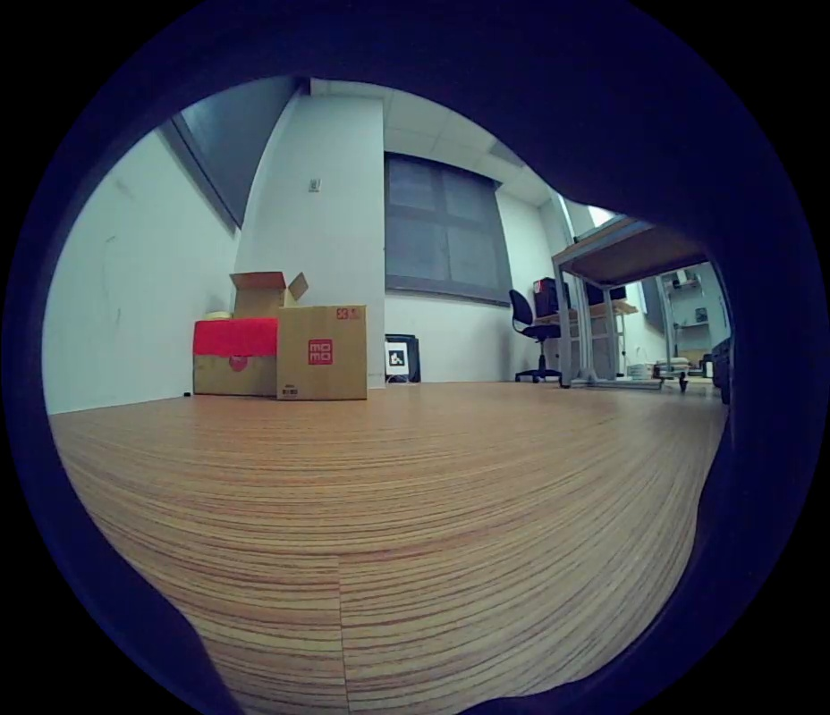
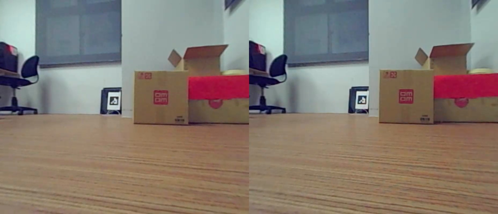
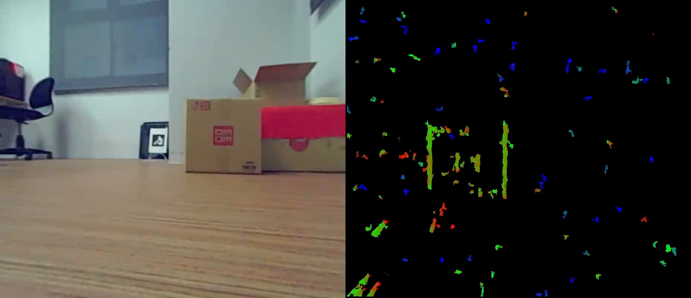

Introduction
---
Unitree Robotics is a energetic start-up company that focuses on the development, production and sales of high-performance quadruped robots. It has been interviewed by BBC and CCTV, and is one of the earliest company to publicly sell quadruped robots.

The company has an outstanding leadership in developing robot core components, motion control, robot perception, etc.

We attaches great importance to research and development, and thus independently developed the motors, reducers, controllers, and even some sensors of the quadruped robot.

1.Overview
---
UnitreecameraSDK 1.1.0 is a cross-platform library for unitree stereo cameras

The SDK allows depth and color streaming, and provides intrinsic calibration information. The library also offers pointcloud, depth image aligned to color image.

2.Dependencies
---

OpenCV, version: equal or lager than 4 (need gstreamer)

CMake, version: 2.8 or higher

[OpenGL] for point cloud gui

[GLUT] for point cloud gui

[X11], for point cloud gui 

3.Build
---

Download the source code of [opencv4.1.1](
https://onedrive.live.com/?authkey=!AAgd-2ZcuPDFM4E&cid=CDE1BA91EFBCF992&id=CDE1BA91EFBCF992!739&parId=CDE1BA91EFBCF992!738&o=OneUp) and unzip it.

First, add following line in:  `opencv-4.1.1/modules/gapi/test/gapi_async_test.cpp` 
```
#include <thread>
```

Second, `sudo apt install libeigen3-dev` and change following line in: `opencv-4.1.1/modules/core/include/opencv2/core/private.hpp`
modify this line
```
# include <Eigen/Core>
```
into
```
# include <eigen3/Eigen/Core>
```

Now, you can compile opencv in your machine.

```
mkdir build
cd build
cmake -D OPENCV_GENERATE_PKGCONFIG=YES ..
make -j16
sudo make install
```

After it, `sudo apt install libyaml-dev` and compile UnitreecameraSDK

```
cd UnitreecameraSDK;
mkdir build && cd build;
cmake ..; make
```

4.Run Examples
---

Get Camera Raw Frame:
```
cd UnitreecameraSDK; 
./bin/example_getRawFrame 
```

Get Calibration Parameters File
```
cd UnitreecameraSDK;
./bin/example_getCalibParamsFile 
```

Get Rectify Frame
```
cd UnitreecameraSDK;
./bin/example_getRectFrame
```

Get Depth Frame
```
cd UnitreecameraSDK;
./bin/example_getDepthFrame
```

Get Point Cloud:
```
cd UnitreecameraSDK; 
./bin/example_getPointCloud
```

5.Gstreamer Go1 camera
---

Stop the camera-related processes that come with the board.
```
ps -aux | grep point_cloud_node | awk '{print $2}' | xargs kill -9
ps -aux | grep mqttControlNode | awk '{print $2}' | xargs kill -9
ps -aux | grep live_human_pose | awk '{print $2}' | xargs kill -9
ps -aux | grep rosnode | awk '{print $2}' | xargs kill -9
```

There is shell script to executes those command easily `bash killall.sh`


### Sender
Default sender:put image to another devices
```
cd UnitreecameraSDK; 
./bin/example_putImagetrans
```

or advance sender: pass config .yaml as an argument and parse the important config that tuneable
```
cd UnitreecameraSDK; 
./bin/example_putImagetransV1 trans_rect_config.yaml
```
Modify following configs that related to target device address, device node of camera address, and also transfering mode.
```
#UDP address for image transfer 192.168.123.IpLastSegment
IpLastSegment: !!opencv-matrix
   rows: 1
   cols: 1
   dt: d
   data: [ 200. ]
#DeviceNode
DeviceNode: !!opencv-matrix
   rows: 1
   cols: 1
   dt: d
   data: [ 0. ]
#0 ori img - right  1 ori img - stereo  2 rect img - right  3 rect img - stereo   -1 不传图
Transmode: !!opencv-matrix
   rows: 1
   cols: 1
   dt: d
   data: [ 3. ] 
```

---
### Receiver
Default c++ listener:get image from another devices,
```
cd UnitreecameraSDK 
./bin/example_getimagetrans
```

or the python script for get image from another devices.
```
cd UnitreecameraSDK/scripts/ 
python3 example_getImagetrans.py --device 192.168.123.xx --host 920x
```

Note: using pip3 to install opencv-python and opencv-contrib-python will lack dependencies, and you must install opencv from source code

6.Example Result
---
### Front Camera - Original Image
<div style="text-align: center;">
    
</div>

### Front Camera - Rect Image
<div style="text-align: center;">
    
</div>

### Front Camera - Depth Image
<div style="text-align: center;">
    
</div>

## References
https://unitree-docs.readthedocs.io/en/latest/get_started/Go1_Edu.html